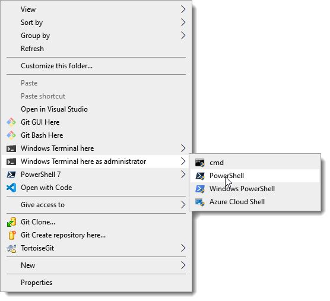
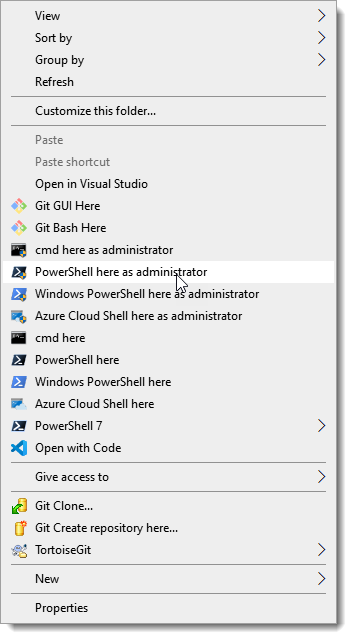
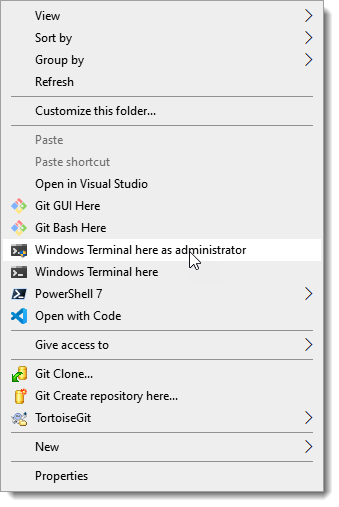

# PowerShell Scripts to Install/Uninstall Context Menu Items for Windows Terminal

*A project backed by [LeXtudio Inc.](https://www.lextudio.com)*

## Install

1. [Install Windows Terminal](https://github.com/microsoft/terminal).
1. [Install PowerShell 7](https://docs.microsoft.com/en-us/powershell/scripting/install/installing-powershell-core-on-windows?view=powershell-7).
1. Launch PowerShell 7 console as administrator, and run `install.ps1` to install context menu items to Windows Explorer.

   > Quickest way to run the latest script from GitHub at an elevated PowerShell 7 console is

   > ``` powershell
   > Set-ExecutionPolicy Bypass -Scope Process -Force; [System.Net.ServicePointManager]::SecurityProtocol = [System.Net.ServicePointManager]::SecurityProtocol -bor 3072; iex ((New-Object System.Net.WebClient).DownloadString('https://raw.githubusercontent.com/lextm/windowsterminal-shell/master/install.ps1'))
   > ```

Now the menu items are added to Windows Explorer context menu.



Figure 1: Default layout

> The menu items are organized in the `default` layout. Other layouts such as `mini` and `flat` give different look and feel. To apply an alternative layout (like `mini`), simply run `install.ps1 mini`.



Figure 2: Flat layout



Figure 3: Mini layout

## Uninstall
1. Run `uninstall.ps1` to uninstall context menu items from Windows Explorer.

> To uninstall an alternative layout (like `mini`), run `uninstall.ps1 mini`.

## Notes
The current release only supports Windows 10 machines (Windows Terminal restriction).

The scripts must be run as administrator.

`install.ps1` and `uninstall.ps1` only manipulate Windows Explorer settings for the context menu items, and do not write to Windows Terminal settings.

Downloading Windows Terminal icon from GitHub (in `install.ps1`) requires internet connection, but in general is just an optional step that won't be executed in most cases.

## More Products
To learn more about other cool products from LeXtudio Inc. , please visit [our homepage](https://www.lextudio.com/#projects).
